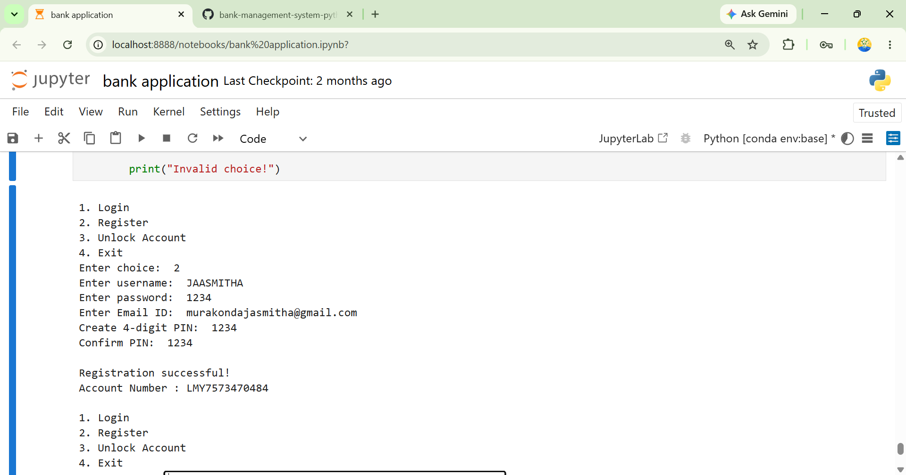
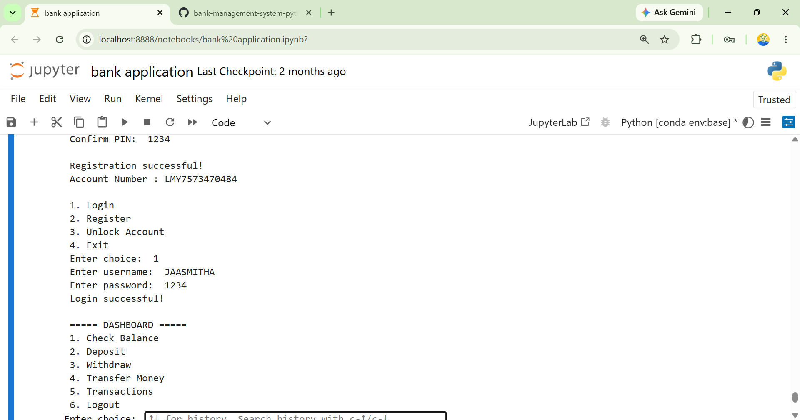
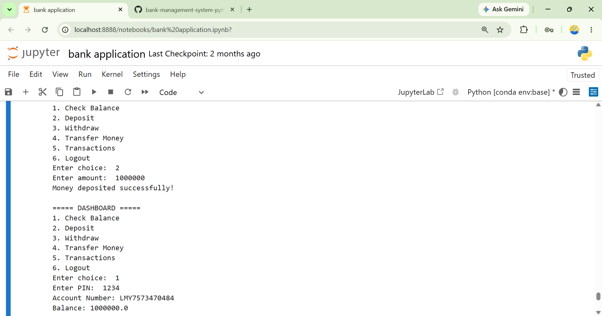
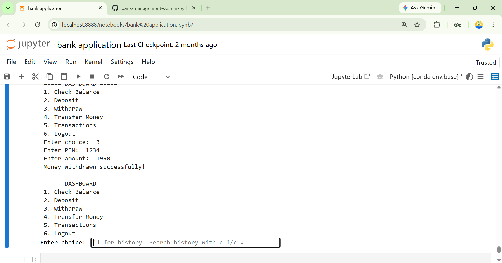
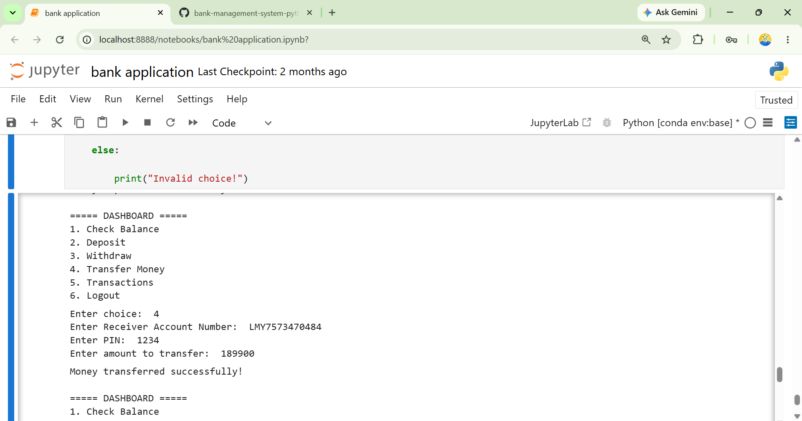
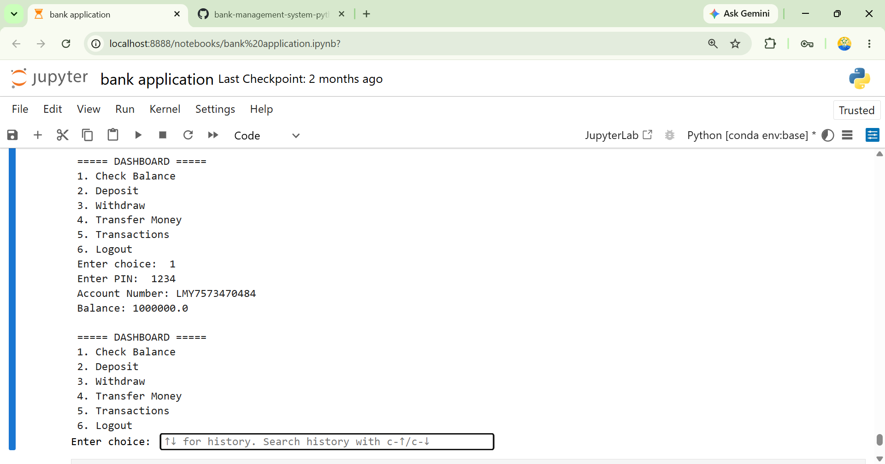
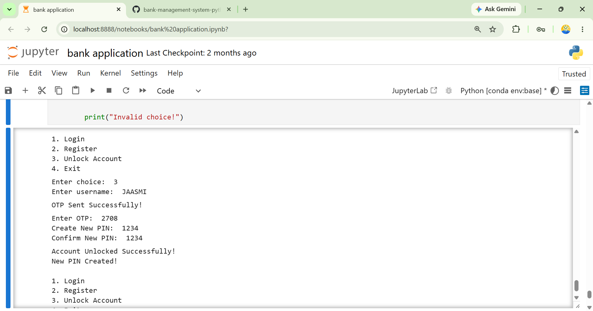

# 🏦 Bank Management System using Python

## 📌 Project Overview

The Bank Management System is a Python-based application developed using Jupyter Notebook to simulate essential banking operations. The system enables users to register securely, log in using email-based OTP verification, perform banking transactions, and maintain transaction history. User information and transaction records are stored using JSON files, providing a simple and efficient data management solution.

---

## ✨ Key Features

- User Registration
- Secure User Login
- Email OTP Verification
- Deposit Money
- Withdraw Money
- Account-to-Account Money Transfer
- Balance Enquiry
- Transaction History
- PIN Reset
- JSON-Based Data Storage

---

## 🛠 Technologies Used

- Python
- Jupyter Notebook
- JSON
- SMTP (Email OTP)
- Random
- String
- Datetime
- Email MIME

---

## 📂 Project Structure

```text
bank-management-system-python/
│
├── bank application.ipynb
├── users.json
├── transactions.json
├── README.md
└── .gitignore
```

---

## 🚀 How to Run

1. Clone or download this repository.
2. Open the project using Jupyter Notebook.
3. Run all notebook cells in sequence.
4. Register a new user account.
5. Verify your email using the OTP.
6. Log in and perform banking operations.

---

## 🔐 Security Features

- Email OTP Verification
- Secure User Authentication
- PIN Reset Functionality
- JSON-Based Data Storage

---

## 📸 Project Screenshots

The following screenshots provide a visual overview of the Bank Management System application and demonstrate its core banking functionalities.

### 🏠 Home Page


### 👤 User Registration



### 🔐 User Login



### 💰 Deposit Money



### 💸 Withdraw Money



### 🔄 Account-to-Account Money Transfer



### 💳 Balance Enquiry



### 📜 Transaction History


### 🔑 Unlock Account



---

## 🔮 Future Enhancements

- MySQL Database Integration
- Graphical User Interface (GUI)
- Interest Calculation
- Loan Management System
- Mini Statement Generation
- PDF Report Generation

---

## 👩‍💻 Author

**Jaasmitha Murakonda**

Master of Computer Applications (MCA)

Python Developer | Software Developer Aspirant

---

## 📄 License

This project is licensed under the MIT License.
